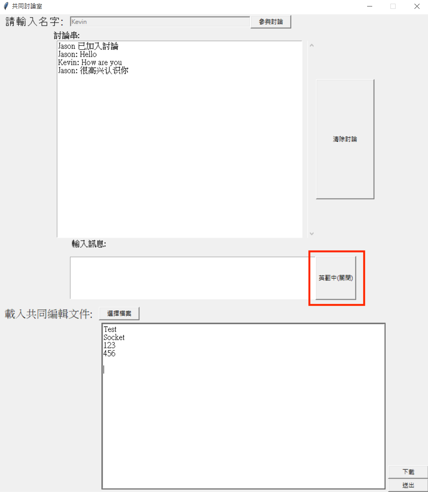

 
# A Real Time Chatroom with translation and file editor

### Installation : 

1. To install the chatroom:
```
$ git clone https://github.com/TseAnLin/chatroom.git
$ conda install pytorch torchvision torchaudio cudatoolkit=11.3 -c pytorch
$ pip install sentencepiece
$ pip install transformers
```
### Implementation
1. Run server
```
$ python server.py
```
2. Run client
```
$ python client.py
```
### Display
Chatroom UI


Translate English text to Chinese <br>


  

	 

  

